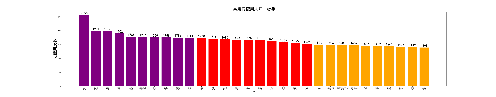
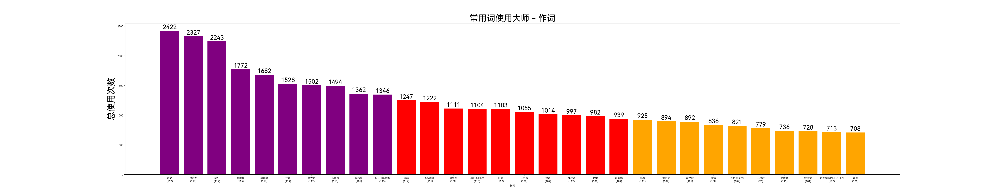
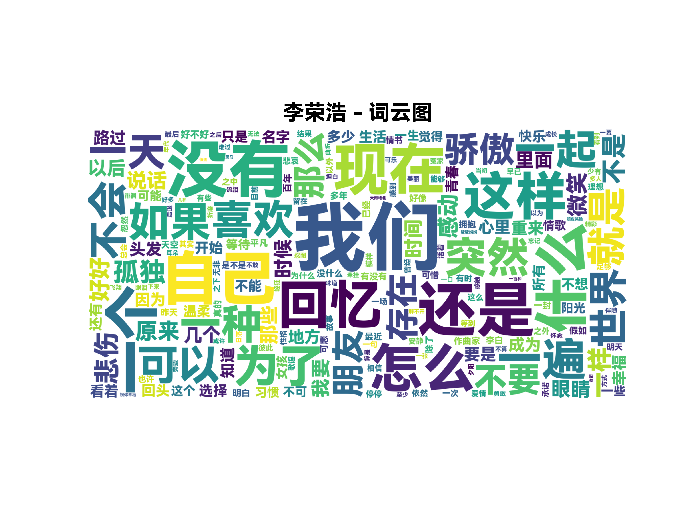
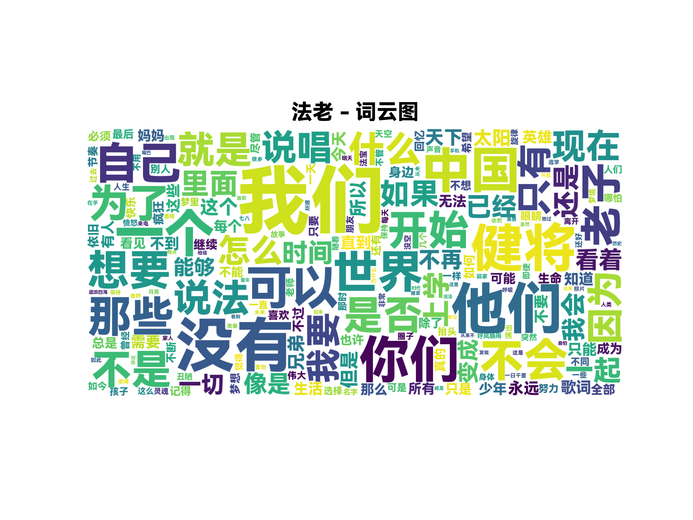
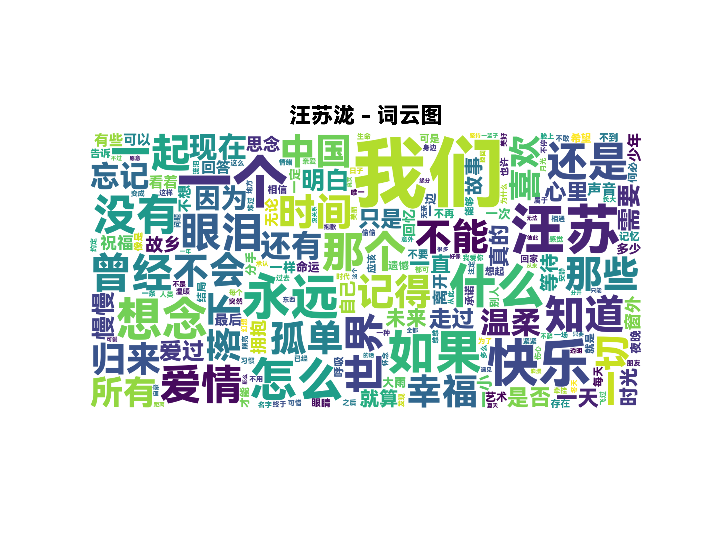
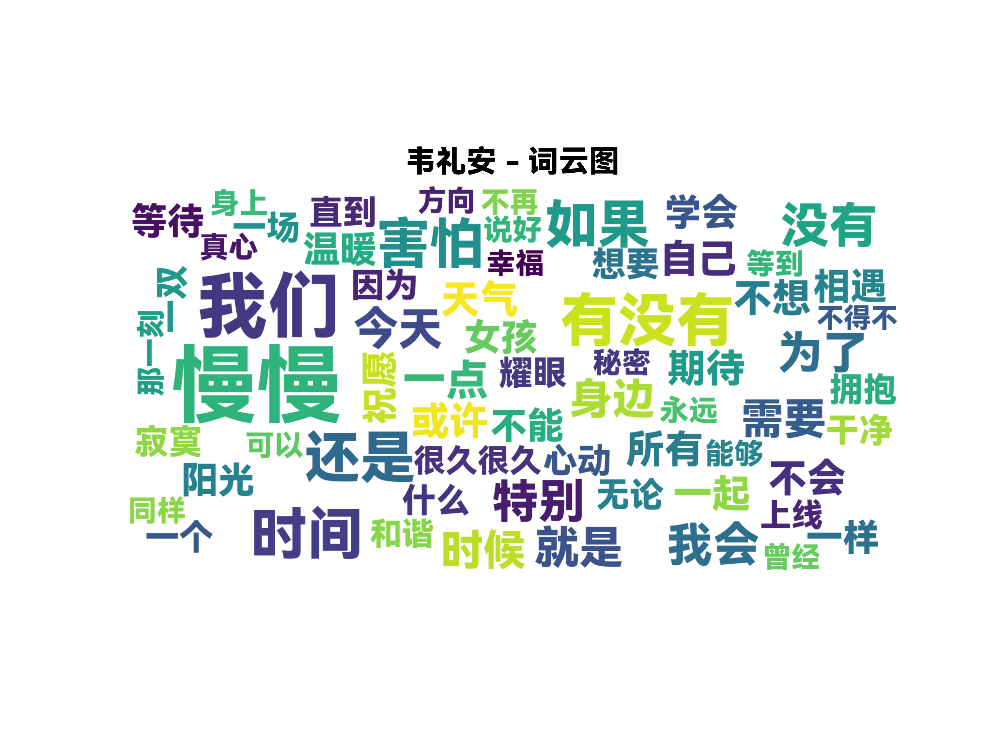
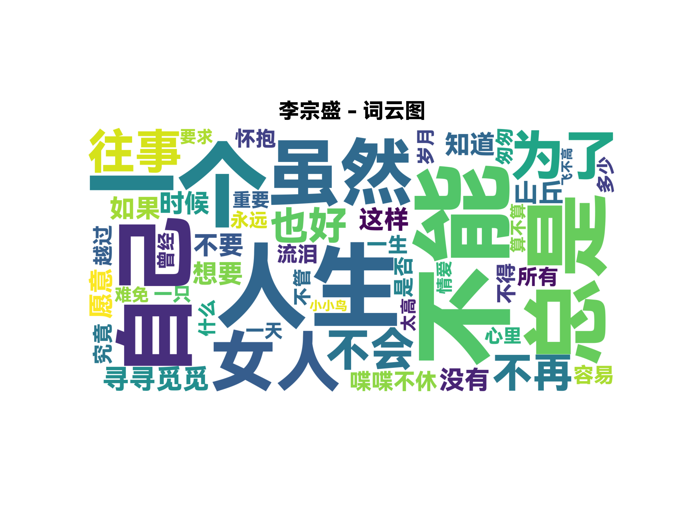

# 常用词使用大师分析

对 4718 首歌曲的歌词进行 jieba 分词，筛选出现频次 >500 的二字及以上中文词语（排除「作曲」「编曲」「混音」等制作信息词），共得到 **119 个高频常用词**。统计每个高频词下使用最多的歌手和作词人，汇总得出「常用词使用大师」排名。

> 指标说明：括弧内第一项为「覆盖词数」（使用过常用词里面的多少项），第二项为「总使用次数」（在该歌手/作词所有出现的高频词中，使用次数的总和）。

---

## 一、歌手 - 常用词使用大师 Top10

| 排名   | 歌手        | 覆盖词数 | 总使用次数 |
| ---- | --------- | ---- | ----- |
| 1    | 法老        | 117  | 2558  |
| 2    | 汪苏泷       | 118  | 1991  |
| 3    | 张震岳       | 118  | 1988  |
| 4    | 萧亚轩       | 116  | 1902  |
| 5    | GAI周延     | 118  | 1788  |
| 6    | G.E.M.邓紫棋 | 118  | 1764  |
| 7    | 范玮琪       | 115  | 1759  |
| 8    | 梁静茹       | 116  | 1758  |
| 9    | 黄丽玲       | 119  | 1756  |
| 10   | 方大同       | 115  | 1741  |

---

## 二、作词 - 常用词使用大师 Top10

| 排名   | 作词        | 覆盖词数 | 总使用次数 |
| ---- | --------- | ---- | ----- |
| 1    | 法老        | 117  | 2422  |
| 2    | 姚若龙       | 117  | 2327  |
| 3    | 林夕        | 117  | 2243  |
| 4    | 易家扬       | 115  | 1772  |
| 5    | 李焯雄       | 117  | 1682  |
| 6    | 娃娃        | 119  | 1528  |
| 7    | 葛大为       | 112  | 1502  |
| 8    | 张震岳       | 116  | 1494  |
| 9    | 李宗盛       | 105  | 1362  |
| 10   | G.E.M.邓紫棋 | 115  | 1346  |

---

## 三、高频常用词 Top 20

| 排名   | 词语   | 出现次数 | 标志性作词（使用最多） | 标志性歌手（演唱最多）       |
| ---- | ---- | ---- | ----------- | ----------------- |
| 1    | 我们   | 4986 | GAI周延 (158) | GAI周延 (170)       |
| 2    | 没有   | 3349 | 法老 (90)     | 法老 (93)           |
| 3    | 一个   | 2967 | 林夕 (106)    | 曾沛慈 (84)          |
| 4    | 自己   | 2495 | 姚若龙 (78)    | 萧亚轩 (69)          |
| 5    | 什么   | 2417 | 林夕 (93)     | 张惠妹 (69)          |
| 6    | 世界   | 2026 | 法老 (51)     | 华晨宇 (65)          |
| 7    | 怎么   | 1856 | 林夕 (44)     | 曾沛慈 (58)          |
| 8    | 如果   | 1749 | 林夕 (64)     | 范玮琪 (91)          |
| 9    | 还是   | 1676 | 李焯雄 (53)    | ChiliChill乐团 (60) |
| 10   | 不会   | 1647 | 法老 (51)     | 法老 (53)           |
| 11   | 知道   | 1597 | 李宗盛 (48)    | 张学友 (52)          |
| 12   | 时间   | 1500 | 葛大为 (40)    | ChiliChill乐团 (40) |
| 13   | 不是   | 1433 | 法老 (54)     | 法老 (54)           |
| 14   | 可以   | 1371 | 法老 (57)     | 法老 (57)           |
| 15   | 所有   | 1327 | h3R3 (33)   | h3R3 (28)         |
| 16   | 不能   | 1307 | 李宗盛 (39)    | 胡彦斌 (38)          |
| 17   | 不要   | 1276 | 张震岳 (58)    | 王力宏 (57)          |
| 18   | 永远   | 1253 | 陶喆 (33)     | 陶喆 (44)           |
| 19   | 回忆   | 1215 | 徐良 (32)     | 郭静 (37)           |
| 20   | 爱情   | 1205 | 易家扬 (62)    | 萧亚轩 (57)          |

---

## 四、数据分析与结论

### 1. 常用词之王：法老

法老同时在 **歌手榜和作词榜位列第一**，覆盖 117/119 个常用词，总使用次数均遥遥领先（歌手 2558 / 作词 2422）。

值得注意的是，他在「他们」（写 76 / 唱 85）、「我要」（写 40 / 唱 40）、「为了」（写 44 / 唱 44）等词的碾压级领先，反映出说唱歌词 **强烈的第一人称叙事特征** 。

### 2. 华语词坛三巨头：姚若龙、林夕、李焯雄

作词榜中除开法老以外，姚若龙（2327）、林夕（2243）、李焯雄（1682）稳居前三。他们是华语情歌黄金时代的核心词人，作品量巨大。林夕覆盖 117 个常用词，在「一个」（106 次，远超第二名的 65 次）和「什么」（93 次）上呈压倒性优势，姚若龙则在「幸福」（71 次）、「相信」（50 次）、「记得」（44 次）等正向情感词上领跑。

### 3. 词语的垄断

部分高频词出现了 **单一人物垄断** 的现象：

| 词语   | 垄断者  | 使用次数            | 第二名      | 倍数   |
| ---- | ---- | --------------- | -------- | ---- |
| 一样   | 李荣浩  | 72 (写) / 79 (唱) | 薛之谦 32   | 2.3× |
| 他们   | 法老   | 76 (写) / 85 (唱) | GAI周延 53 | 1.4× |
| 总是   | 李宗盛  | 58 (写)          | 姚若龙 26   | 2.2× |
| 慢慢   | 韦礼安  | 42 (写) / 42 (唱) | 白进法 33   | 1.3× |
| 爱情   | 易家扬  | 62 (写)          | 方文山 38   | 1.6× |
| 幸福   | 姚若龙  | 71 (写)          | 徐世珍 39   | 1.8× |

下面给出李荣浩，法老，汪苏泷，韦礼安，李宗盛的词云图，可以印证高频常用词和单一人物垄断的现象：

