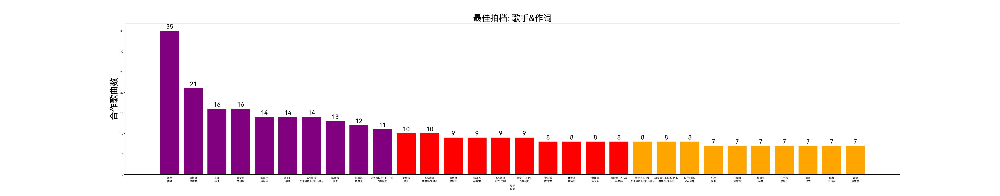
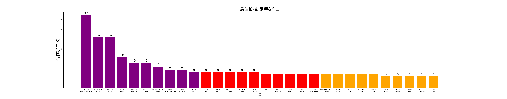
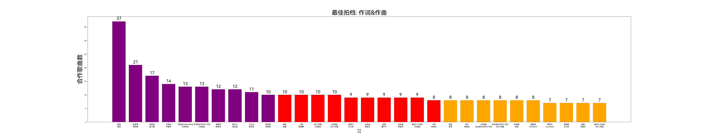

# 最佳拍档分析

根据爬取到的数据，统计歌手&作词、歌手&作曲、作词&作曲之间的合作次数，找出华语乐坛最紧密的创作搭档。（数据范围：1380 位歌手，4718 首歌曲。合作次数指两人同时出现在同一首歌中的次数。）

---

## 一、歌手 & 作词 Top10

| 排名   | 歌手            | 作词            | 合作次数 |
| ---- | ------------- | ------------- | ---- |
| 1    | 陶喆            | 娃娃            | 35   |
| 2    | 周传雄           | 陈信荣           | 21   |
| 3    | 王菲            | 林夕            | 16   |
| 4    | 莫文蔚           | 李焯雄           | 16   |
| 5    | 华晨宇           | 吕易秋           | 14   |
| 6    | 萧亚轩           | 姚谦            | 14   |
| 7    | GAI周延         | 功夫胖KUNGFU-PEN | 14   |
| 8    | 陈奕迅           | 林夕            | 13   |
| 9    | 陈奕迅           | 黄伟文           | 12   |
| 10   | 功夫胖KUNGFU-PEN | GAI周延         | 11   |

## 二、歌手 & 作曲 Top10

| 排名   | 歌手             | 作曲               | 合作次数 |
| ---- | -------------- | ---------------- | ---- |
| 1    | HOYO-MiX       | 陈致逸 Yu-Peng Chen | 37   |
| 2    | 三Z-STUDIO      | 杨武韬              | 26   |
| 3    | HOYO-MiX       | 杨武韬              | 26   |
| 4    | 孙燕姿            | 李偲菘              | 16   |
| 5    | HOYO-MiX       | 王可鑫 Eli.W        | 13   |
| 6    | 万妮达Vinida Weng | HARIKIRI         | 13   |
| 7    | 功夫胖KUNGFU-PEN  | GAI周延            | 11   |
| 8    | GAI周延          | 功夫胖KUNGFU-PEN    | 9    |
| 9    | GAI周延          | KEY.L刘聪          | 9    |
| 10   | 洛天依            | WOVOP            | 8    |

## 三、作词 & 作曲 Top10

| 排名   | 作词             | 作曲       | 合作次数 |
| ---- | -------------- | -------- | ---- |
| 1    | 娃娃             | 陶喆       | 37   |
| 2    | 陈信荣            | 周传雄      | 21   |
| 3    | 姚若龙            | 陈小霞      | 17   |
| 4    | 吕易秋            | 华晨宇      | 14   |
| 5    | 万妮达Vinida Weng | HARIKIRI | 13   |
| 6    | 功夫胖KUNGFU-PEN  | GAI周延    | 13   |
| 7    | 易家扬            | 林俊杰      | 12   |
| 8    | 葛大为            | 徐佳莹      | 12   |
| 9    | 方文山            | 周杰伦      | 11   |
| 10   | 姚若龙            | 李偲菘      | 10   |

完整配对统计：歌手&作词 6015 对、歌手&作曲 5836 对、作词&作曲 4413 对。

**（去除了拍档的两人相同的情况。）**

---

## 四、数据分析与结论

### 1. 陶喆&娃娃：金牌搭档

陶喆&娃娃以 35 次合作登顶歌手&作词榜，词曲榜中娃娃&陶喆也是 37 次高居第一。这说明相当多的情况下，**陶喆包办自己歌曲的作曲，娃娃则包办作词**。周传雄&陈信荣（21 次），万妮达&HARIKIRI（13 次）是同样的模式。

### 2. 游戏音乐的工业化生产

HOYO-MiX（米哈游音乐厂牌）占据歌手&作曲榜第 1、3、5 名，三Z-STUDIO（绝区零音乐厂牌）及塞壬唱片-MSR（明日方舟音乐厂牌）也在排行榜前列。这反映出 **游戏配乐是高度工业化的流水线生产**：固定厂牌 + 固定作曲班底的大量产出。

### 3. 中文说唱的超级团体

GAI周延、功夫胖KUNGFU-PEN、盛宇D-SHINE、KEY.L刘聪四人（后三人均为 C-Block 成员）之间的交叉合作非常频繁：

- 歌手&作词榜：**51 **条
- 歌手&作曲榜：**46** 条
- 作词&作曲榜：**33** 条

**这些成员之间互为作词，互为作曲，互相唱对方作词作曲的歌曲，形成了一种「像是乐队又不是乐队」的合作模式。**
