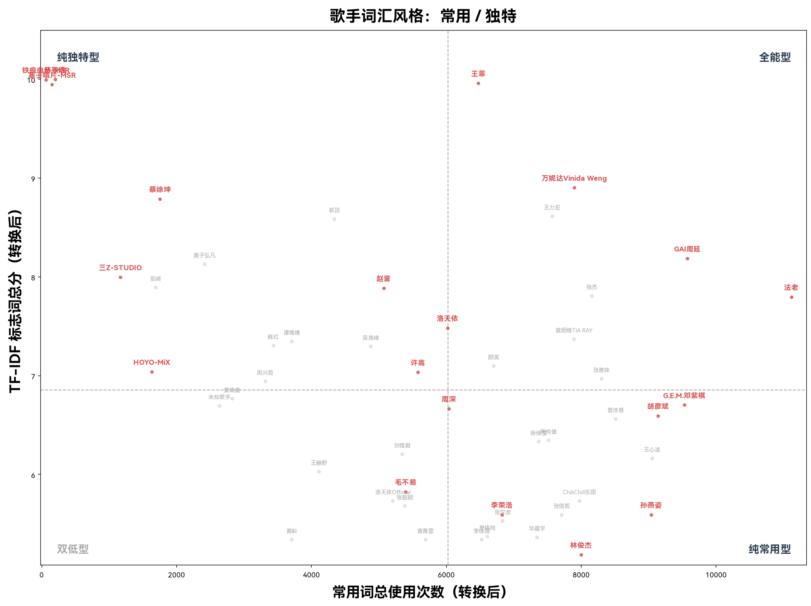

# 独特词使用大师分析

对 1,380 位歌手的所有歌词进行 TF-IDF 分析，提取每位歌手最具个人标志性的词汇。TF-IDF 排行反映的是「谁拥有别人没有的词汇」，与常用词分析形成互补。

> **指标说明**：每位歌手的分数为 Top10 标志词的 TF-IDF 总和。标志词经过过滤：排除歌手/作词人名、制作信息词、含标点行，且全局出现至少 10 次。

---

## 一、独特词使用大师 Top 20

| 排名   | 歌手             | TF-IDF 总分 | #1 标志词 | #2 标志词 | #3 标志词 |
| ---- | -------------- | --------- | ------ | ------ | ------ |
| 1    | 陈致逸            | 0.4545    | 铠甲     | 勇士     | 战场     |
| 2    | 铁痕电台-MSR       | 0.4108    | 万象     | 虫鸣     | 同游     |
| 3    | 王菲             | 0.3062    | 须菩提    | 如来     | 世尊     |
| 4    | 塞壬唱片-MSR       | 0.2884    | 天黑黑    | 万象     | 一緒     |
| 5    | 蔡徐坤            | 0.1291    | 渡成     | 起死回生   | 失灵     |
| 6    | 万妮达Vinida Weng | 0.1210    | 莫加     | 榻榻米    | 万妮     |
| 7    | 王力宏            | 0.1051    | 盖世英雄   | 恭喜     | 迫不及待   |
| 8    | 赵雷             | 0.0938    | 小屋     | 赵小雷    | 阿刁     |
| 9    | 黄子弘凡           | 0.0931    | 一半一半   | 一瓣     | 心连     |
| 10   | 三Z-STUDIO      | 0.0892    | 数星星    | 掌控     | 面目全非   |
| 11   | 法老             | 0.0871    | 健将     | 老子     | 说唱     |
| 12   | 安崎             | 0.0865    | 逆战     | 王牌     | 好歌     |
| 13   | 张杰             | 0.0843    | 赛尔     | 恭喜     | 爬上来    |
| 14   | GAI周延          | 0.0823    | 重庆     | 湘里别    | 解放碑    |
| 15   | 洛天依            | 0.0766    | 喂喂     | 嘟嘟     | 初音     |
| 16   | 袁娅维TIA RAY     | 0.0742    | 袁娅维    | 卑鄙     | 遇上爱    |
| 17   | 谭维维            | 0.0734    | 维维     | 小红花    | 中国     |
| 18   | 韩红             | 0.0728    | 小红花    | 郁可     | 咿呀     |
| 19   | 吴青峰            | 0.0719    | 波妞     | 人烂事    | 叶子     |
| 20   | 那英             | 0.0687    | 冲冲     | 相约     | 澎湖湾    |

---

## 二、四象限分类：常用词 × 独特词

以常用词总使用次数与 TF-IDF 标志词总分为坐标轴，以中位数为界，49 位歌手落入四个象限。以下用各象限代表人物举例。

### 全能型（9 人）——常用词多 + 独特词多

**王菲、法老、万妮达Vinida Weng、GAI周延、王力宏、张杰、袁娅维TIA RAY、那英、张惠妹**

两边都高于中位数的「双修」歌手。举例分析：

- **王菲**：多用佛经词汇（须菩提/如来/菩萨），这与她的作品《金刚经》密切相关。
- **万妮达**：多用福州方言（莫加/咔溜/七溜八溜），这与她的代表作《七溜八溜 WAIYA》密切相关。
- **GAI周延**：多用重庆/湖南方言（重庆/解放碑/湘里别），这与他经常合作的长沙说唱厂牌 C-BLOCK 密切相关。

### 纯独特型（16 人）——常用词少 + 独特词多

**陈致逸、铁痕电台-MSR、塞壬唱片-MSR、蔡徐坤、黄子弘凡、三Z-STUDIO、安崎、赵雷、洛天依、谭维维、韩红、吴青峰、HOYO-MiX、许嵩、周兴哲、窦靖童**

这些歌手的歌词量不一定大，但用词进入了别人没有的领域。**注意到游戏配乐 / 动画配乐占据了其中的大多数**，尤其是左上角的陈致逸、塞壬唱片，铁痕唱片「三巨头」。

### 纯常用型（16 人）——常用词多 + 独特词少

**G.E.M.邓紫棋、周深、胡彦斌、曾沛慈、周传雄、徐佳莹、王心凌、ChiliChill乐团、张信哲、孙燕姿、李荣浩、张学友、单依纯、华晨宇、李佳薇、林俊杰**

高产的主流流行歌手，使用大量大众高频词，但缺乏强烈的个人标志词汇。部分用词口语化的歌手（如 Chilichill 乐团）也在其中。

### 双低型（8 人）——常用词少 + 独特词少

**刘惜君、王赫野、毛不易、洛天依Official、张靓颖、黄龄、黄霄雲**

歌曲量相对较少，或用词偏均衡，两边都不突出。

